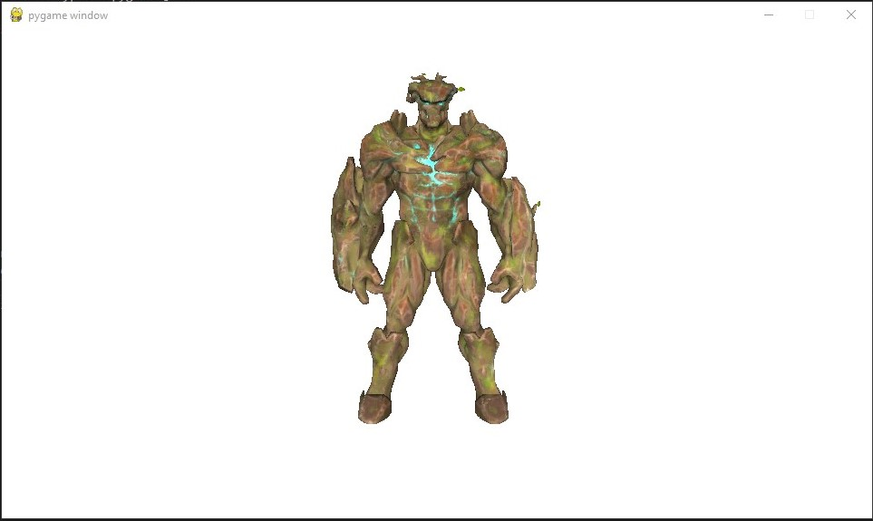
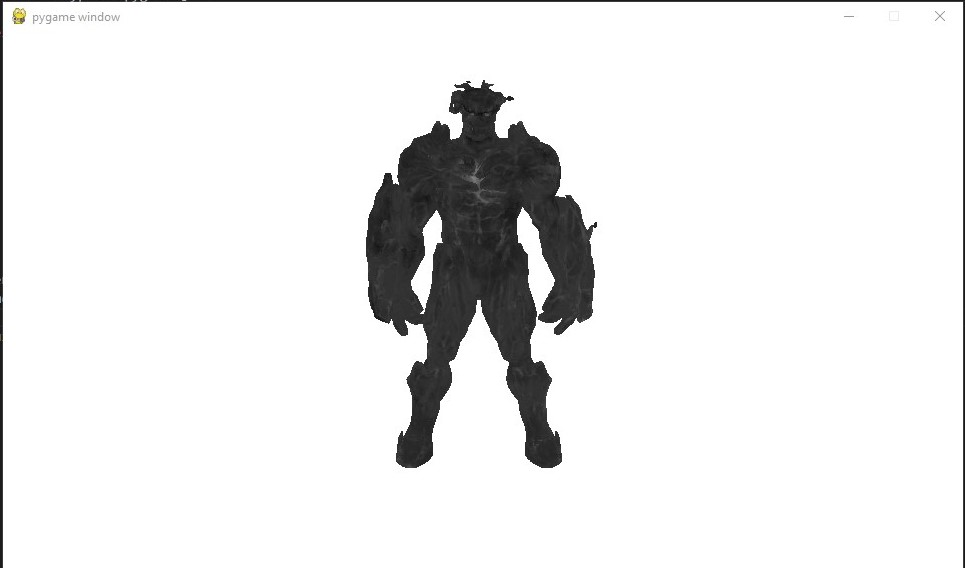
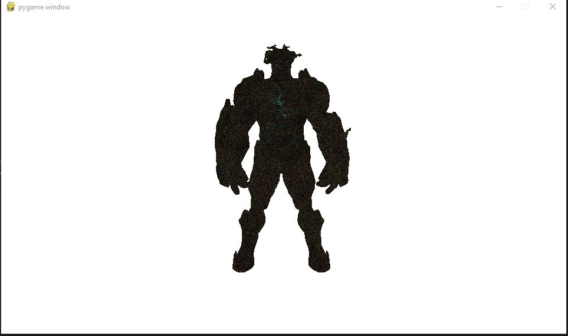
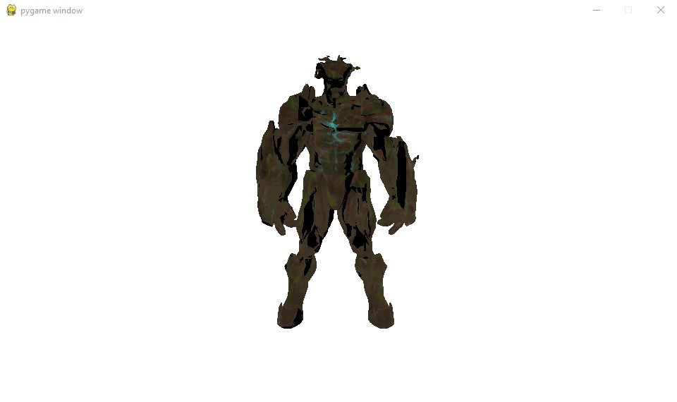

# LABORATORIO 4 OPENGL SHADERS 2

## Detalles
El objetivo de este laboratorio es que practiquen la creación de shaders (tanto Vertex como Fragment) en base a GLSL y para uso en un renderer hecho en OpenGL.
 
 
Para este lab, tienen que crear distintas variaciones de shaders y mostrar los resultados en un sólo modelo de su elección usando su renderer. Deben usar las teclas numéricas (1, 2, 3...) para cambiar la configuración de shaders durante la ejecución del programa. La nota de los criterios subjetivos dependerá de qué tan complejos e interesantes sean los shaders que implementen.

## Puntos
[Criterio subjetivo] 30 puntos por un nuevo Vertex o Fragment shader.
 
[Criterio subjetivo] 30 puntos por un nuevo Vertex o Fragment shader.
 
[Criterio subjetivo] 30 puntos por un nuevo Vertex o Fragment shader.
 
[Criterio subjetivo] 30 puntos por un nuevo Vertex o Fragment shader.

## Outputs 

Los outputs obtenidos son los siguientes

### Fresnel Fragment Shader 

### Grey Scale Fragment Shader 

### Noise Fragment Shader

### Stripes Fragment Shader

